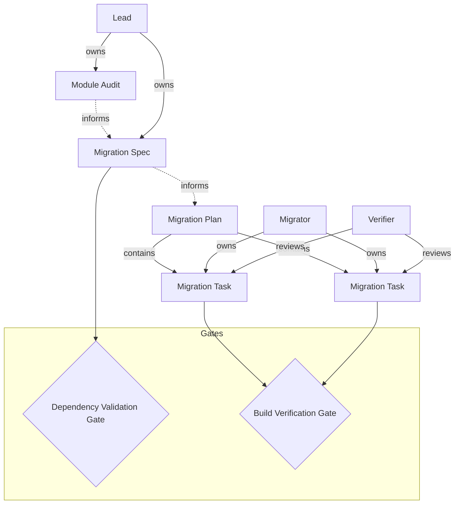

# Shape: Crate Restructure

> A methodology for reorganising Rust crate internals — auditing module structure, extracting shared types, relocating business logic to appropriate layers, and verifying compilation and tests at every step.

## Philosophy

Good crate structure makes the architecture legible. When files accumulate flat in a source directory, the implicit structure in developers' heads diverges from the explicit structure on disk. Restructuring isn't cosmetic — it reduces cognitive overhead, prevents coupling drift, and makes onboarding faster. Move deliberately: understand the dependency graph first, extract shared types before moving consumers, and verify compilation at every step.

## Guiding Principles

- **Dependency graph first, file moves second:** Map what depends on what before touching anything. The graph tells you the move order.
- **Shared types move before consumers:** If six files depend on a broadcast event type, move the type to its new home first, update consumers, then move the consumers.
- **Compile after every move:** A restructure that breaks the build wastes everyone's time. Every logical unit of work must leave the codebase compiling and tests passing.
- **Relocate, don't rewrite:** The goal is better organisation, not new abstractions. Move code as-is, fix import paths, and resist the urge to refactor logic while restructuring.
- **Layer boundaries matter:** Business logic belongs in the services layer, HTTP handlers belong in the server layer, types belong in the types layer. If something is in the wrong layer, move it — don't add a shim.

## Structure

---

## Documents

### Module Audit

> A comprehensive inventory of every file in the target crate, its line count, purpose, dependencies, and which logical group it belongs to. The audit reveals the implicit structure that the restructure will make explicit.

#### Structure

- **Crate Overview:** What the crate does, its role in the dependency stack, its current module count and total line count
- **File Inventory:** Every file with line count, one-line purpose, and inbound/outbound dependencies within the crate
- **Dependency Graph:** Which files import from which other files — the cross-dependency map that determines move order
- **Shared Types:** Types used across multiple files that need to be extracted or relocated before consumers can move
- **Logical Groups:** Proposed groupings of related files into modules or sub-modules, with justification
- **External Consumers:** Other crates that import from this crate — what public API surface must be preserved

#### Attributes

- id: string, required — unique identifier, prefix AUDIT-
- title: string, required — which crate is being audited
- status: draft | active | approved — lifecycle state
- owned_by: reference -> Lead — the lead who owns this audit
- crate_name: string, required — the Rust crate being restructured
- total_files: number — total file count in the crate
- total_lines: number — total line count
- created_at: datetime — when this record was created
- updated_at: datetime — when this record was last modified

#### Status Flow

draft -> active -> approved

#### Relationships

| Edge | To | Description |
|------|----|-------------|
| INFORMS | Migration Spec | The audit provides the data needed to design the migration |
| OWNED_BY | Lead | The lead who conducts the audit |

#### Instructions

You are conducting a Module Audit. This is a factual inventory — no opinions, no proposed changes yet. Just map what exists.

For every file in the target crate's src/ directory:
- Count lines (excluding blank lines and comments if significant)
- Write a one-line description of what the file does
- List every `use crate::` import (inbound dependencies)
- List every file that imports from this file (outbound dependents)
- Note any public types that other crates depend on

Group files by logical affinity, but don't prescribe the grouping yet — that comes in the Migration Spec.

### Migration Spec

> The technical specification for the restructure — where each file moves, which types need extraction, the dependency resolution order, and the public API preservation strategy.

#### Structure

- **Target Structure:** The desired module layout after restructure, shown as a tree
- **Type Extractions:** Shared types that need to move to a common location before consumers move
- **Move Order:** The sequence of file moves that respects the dependency graph — types first, then leaf consumers, then hub files
- **Import Path Changes:** For each moved file, the old and new import paths
- **Public API Preservation:** Which re-exports need to exist so external crates don't break
- **Crate Boundary Changes:** If any code is moving between crates, what Cargo.toml changes are needed

#### Attributes

- id: string, required — unique identifier, prefix MSPEC-
- title: string, required — what restructure this spec covers
- status: draft | review | approved — lifecycle state
- owned_by: reference -> Lead — the lead who owns this spec
- target_crate: string, required — which crate is being restructured
- files_moving: number — number of files being relocated
- new_modules: number — number of new modules being created
- created_at: datetime — when this record was created
- updated_at: datetime — when this record was last modified

#### Status Flow

draft -> review -> approved

#### Relationships

| Edge | To | Description |
|------|----|-------------|
| INFORMS | Migration Plan | The spec defines exactly what needs to happen |
| OWNED_BY | Lead | The lead who designs the restructure |

#### Instructions

You are writing a Migration Spec. This must be precise enough that a developer can execute it mechanically — no ambiguity about what moves where or in what order.

Requirements:
- The target structure must be a concrete directory tree, not a vague description
- Every file that moves must have its old path and new path listed explicitly
- The move order must respect dependencies — if file A imports from file B, B moves first (or both move together with import updates)
- Type extractions must specify exactly which types, from which file, to which new location
- Public API changes must be enumerated — every re-export needed for backward compatibility
- If code moves between crates, Cargo.toml dependency changes must be specified

---

## Tasks

### Migration Plan

> An ordered plan that breaks the Migration Spec into concrete, sequential tasks. Each subsection is a self-contained unit of work that leaves the codebase compiling.

#### Structure

- **Overview:** High-level migration approach and ordering strategy
- **Subsections:** Each subsection is a discrete migration step — extract a type, move a module, update imports

#### Attributes

- id: string, required — unique identifier, prefix MPLAN-
- title: string, required — what this plan covers
- status: draft | active | complete — lifecycle state
- owned_by: reference -> Lead — the lead who owns this plan
- total_steps: number — number of migration steps
- created_at: datetime — when this record was created
- updated_at: datetime — when this record was last modified

#### Status Flow

draft -> active -> complete

#### Children

Subsections become **Migration Task** work items.

- title: string, required — task name from the subsection heading
- status: pending | in_progress | completed — lifecycle state
- assigned_to: reference -> Migrator — who executes this step
- acceptance_criteria: string — what "done" looks like (must include "cargo check passes" and "cargo test passes")
- move_order: number — sequential position in the migration

#### Relationships

| Edge | To | Description |
|------|----|-------------|
| CONTAINS | Migration Task | This plan produces these tasks |
| OWNED_BY | Lead | The lead who owns this plan |

#### Instructions

You are writing a Migration Plan. Every step must leave the codebase in a compiling, test-passing state.

Requirements:
- Each subsection should be a single logical move (extract one type, move one module, update one set of imports)
- Order matters — earlier steps must not depend on later steps
- Every step's acceptance criteria must include "cargo check --workspace passes" and "cargo test --workspace passes"
- Group related moves when they must happen atomically (e.g., moving a file and updating all its importers)
- Each step should be committable independently — one commit per task

### Migration Task

> A concrete unit of restructuring work — moving files, updating imports, extracting types, or adding re-exports. Must leave the build green.

#### Structure

- **Scope:** What files move, what imports change, what types are extracted
- **Steps:** Exact sequence of operations (create directory, move file, update imports, add re-exports)
- **Verification:** How to verify this step is complete (cargo check, cargo test, specific test names)

#### Attributes

- id: string, required — unique identifier, prefix MTASK-
- title: string, required — task name
- status: pending | in_progress | completed — lifecycle state
- assigned_to: reference -> Migrator — who executes this step
- acceptance_criteria: string, required — must include build verification
- move_order: number — sequential position in the migration
- parent_id: reference -> Migration Plan — the plan this task came from
- task_tool: boolean — sync this task with Claude Code's native task system
- created_at: datetime — when this record was created
- updated_at: datetime — when this record was last modified

#### Status Flow

pending -> in_progress -> completed

#### Relationships

| Edge | To | Description |
|------|----|-------------|
| PART_OF | Migration Plan | This task is part of a plan |
| ASSIGNED_TO | Migrator | The developer executing this step |

#### Instructions

You are executing a Migration Task. This is a restructuring operation — you are moving code, not rewriting it.

Rules:
- Move files exactly as specified in the Migration Spec. Do not refactor logic while moving.
- Update all import paths in all affected files. Use `cargo check --workspace` to find any you missed.
- If the spec says to add a re-export for backward compatibility, add it.
- Run `cargo check --workspace` after every file move. Fix import errors before proceeding.
- Run `cargo test --workspace` when the task is complete. All tests must pass.
- Commit each completed task independently with a clear message describing what moved.

---

## Roles

### Lead

> Owns the restructure from audit through specification. Responsible for the dependency analysis, target structure design, and move ordering. Coordinates the team and resolves conflicts.

| Profile | Capabilities | Agents |
|---------|--------------|--------|
| coordinator | team-lead, shapesmith | roadmapper, codebase-mapper |

#### Responsibilities

- Conduct the Module Audit with complete file inventory and dependency graph
- Design the target structure in the Migration Spec
- Determine the safe move order that respects dependencies
- Create the Migration Plan with properly scoped steps
- Resolve any import path conflicts or circular dependency issues

#### Instructions

You are the Lead on a crate restructure. Your job is to understand the dependency graph completely before anyone moves a file.

The audit must be exhaustive — every file, every cross-dependency, every shared type. The migration spec must be mechanical — a developer should be able to follow it without judgment calls. The plan must be sequential — every step leaves the build green.

When designing the target structure, optimise for legibility: someone reading the module tree should understand the crate's architecture without opening any files.

### Migrator

> Executes migration tasks — moves files, updates imports, extracts types, adds re-exports. Works methodically through the plan, verifying the build at every step.

| Profile | Capabilities | Agents |
|---------|--------------|--------|
| developer | shapesmith | executor |

#### Responsibilities

- Execute assigned migration tasks following the Migration Spec exactly
- Update all import paths in all affected files
- Verify the build passes after every move
- Commit each completed task independently
- Report any issues with the planned moves (circular deps, unexpected consumers)

#### Instructions

You are a Migrator. You move code exactly as the spec describes — no more, no less.

Your workflow for each task:
1. Read the task scope — what files move, what imports change
2. Make the moves and import updates
3. Run `cargo check --workspace` — fix any errors
4. Run `cargo test --workspace` — all tests must pass
5. Commit with a clear message describing what moved

Do NOT refactor, rename, or improve code while moving it. The restructure and any logic changes are separate concerns. If you see something that should be improved, note it for after the restructure is complete.

### Verifier

> Reviews completed migration tasks for correctness — verifies imports are clean, re-exports work, no dead code was introduced, and the build is green.

| Profile | Capabilities | Agents |
|---------|--------------|--------|
| code-reviewer | shapesmith-observer | code-reviewer |

#### Responsibilities

- Verify that file moves match the Migration Spec
- Check that all import paths are updated correctly
- Confirm no dead code or orphaned re-exports were introduced
- Verify cargo check and cargo test pass
- Check that public API surface is preserved for external consumers

#### Instructions

You are a Verifier. After each migration task, you confirm the restructure was executed correctly.

Check:
- Does the file live where the spec says it should?
- Are all `use` paths updated — no stale `crate::old_path` references remaining?
- If re-exports were added, are they necessary and correct?
- Does `cargo check --workspace` pass with zero warnings related to the move?
- Does `cargo test --workspace` pass?
- Do external crates that depend on this crate still compile?

---

## Decisions

### Dependency Validation Gate

> Verifies the Migration Spec's dependency analysis is correct and the proposed move order won't create circular dependencies or break external consumers.

#### Criteria

- Every file in the crate is accounted for in the audit
- The dependency graph has no undocumented cross-dependencies
- The proposed move order respects the dependency graph — no file moves before its dependencies
- All shared types are identified and their extraction is planned
- External consumer impact is documented and re-exports are planned

Evaluation mode: authority

#### Instructions

This gate verifies the migration spec is safe to execute. The Lead must confirm that the dependency analysis is complete and the move order is sound.

If any dependency is missing from the graph, the spec is not ready. If any move creates a circular dependency, the spec needs revision.

### Build Verification Gate

> Verifies that a completed migration task leaves the codebase in a fully compiling, test-passing state with no regressions.

#### Criteria

- cargo check --workspace passes with no new warnings
- cargo test --workspace passes with no new failures
- No orphaned imports or dead re-exports
- File is in the location specified by the Migration Spec
- External crates that depend on this crate still compile

Evaluation mode: auto

#### Instructions

This gate is simple: does it build and do tests pass? If yes, the task is done. If no, the task needs fixing before it can be marked complete.

---

## Processes

### Migration Review

> Review process triggered when a Migration Task is marked completed. The Verifier checks that the move was executed correctly and the build is green.

#### Trigger

Migration Task status changes to "completed"

#### Sequence

1. Verify Build: Migration Task - Verifier
2. Check Import Paths: Migration Task - Verifier
3. Build Verification Gate
   - allow -> 4
   - block -> 5
4. Approve Migration: Migration Task - Verifier
   - End
5. Return for Fixes: Migration Task - Migrator
   - -> 1

#### Instructions

Every migration task goes through verification. The Verifier checks the build, the imports, and the file locations. No migration task is considered done until the build is green and the spec is satisfied.

---

## Projection

| Primitive | Cadence | View | Task Folder | Assigned To |
|-----------|---------|------|-------------|-------------|
| Migration Plan | — | List | — | Lead |
| Migration Task | Child of Migration Plan | Kanban | true | Migrator |

---

## Relationships

| From | Edge | To |
|------|------|----|
| Module Audit | INFORMS | Migration Spec |
| Migration Spec | INFORMS | Migration Plan |
| Migration Plan | CONTAINS | Migration Task |
| Lead | OWNS | Module Audit |
| Lead | OWNS | Migration Spec |
| Lead | OWNS | Migration Plan |
| Migrator | WORKS_ON | Migration Task |
| Verifier | REVIEWS | Migration Task |
| Dependency Validation Gate | GUARDS | Migration Plan |
| Build Verification Gate | GUARDS | Migration Task |
