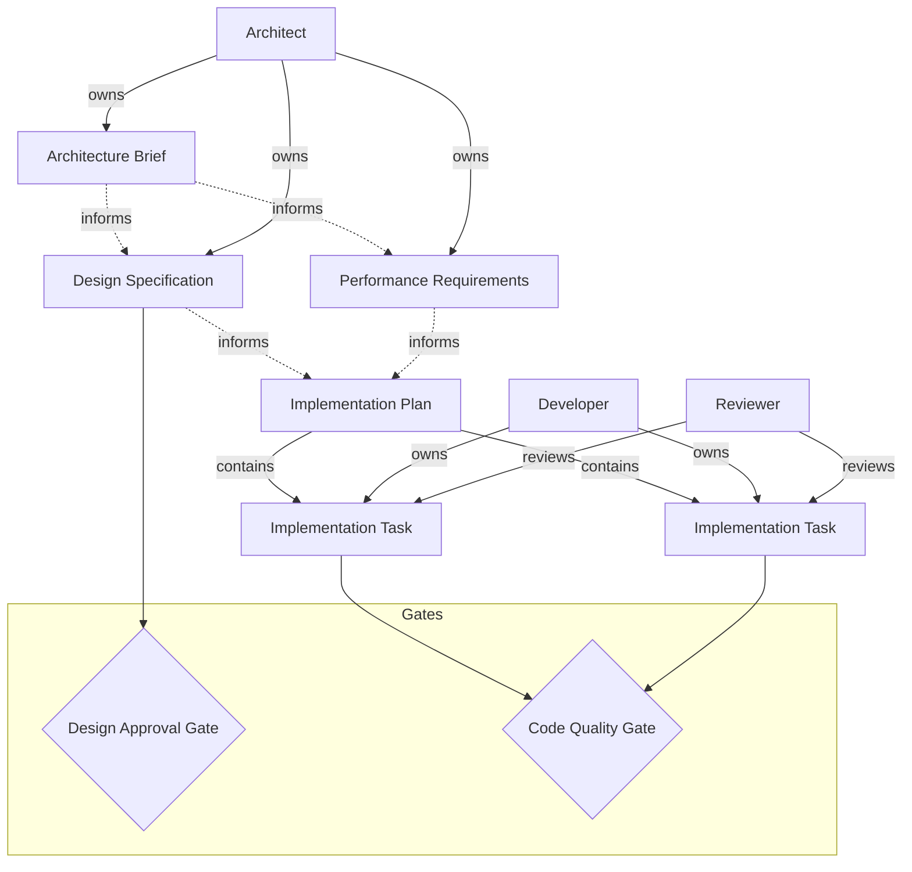

# Shape: System Architecture

> A methodology for building complex software systems from first principles — from architecture brief through design, implementation planning, and task execution.

## Philosophy

Complex systems emerge from clear thinking at each level of abstraction. Start with the problem, not the solution. Let the architecture inform the design, the design inform the plan, and the plan produce concrete tasks. Each tier builds on the one before it — never skip ahead.

## Guiding Principles

- **Architecture drives design, design drives implementation:** Each tier produces context that constrains and informs the next. Jumping straight to code without a brief or spec creates rework.
- **Specifications are executable:** A good spec is precise enough that implementation becomes translation, not invention.
- **Plans decompose into tasks:** An implementation plan isn't a wish list — its subsections become concrete work items with owners and acceptance criteria.
- **Review gates enforce quality, not ceremony:** Gates exist because complex systems have expensive failure modes. Catch issues early.

## Structure

---

## Documents

### Architecture Brief

> The foundational document that defines what we're building, why, and the high-level approach. Everything else flows from this.

#### Structure

- **Problem Statement:** What problem are we solving and for whom
- **Goals:** What success looks like, measurably
- **Constraints:** Hard limits — performance, compatibility, time, budget
- **High-Level Approach:** Architecture style, key technology choices, major components
- **Non-Goals:** What we are explicitly not building

#### Attributes

- id: string, required — unique identifier, prefix BRIEF-
- title: string, required — clear name for this architecture
- status: draft | active | approved | archived — lifecycle state
- owned_by: reference -> Architect — the architect who owns this brief
- problem_statement: string, required — what problem we're solving
- goals: string, required — measurable success criteria
- constraints: string, required — hard limits and boundaries
- approach: string, required — high-level architecture and technology choices
- non_goals: string — what we're explicitly not building
- created_at: datetime — when this record was created
- updated_at: datetime — when this record was last modified

#### Status Flow

draft -> active -> approved -> archived

#### Relationships

| Edge | To | Description |
|------|----|-------------|
| INFORMS | Design Specification | This brief provides the foundation for detailed design |
| INFORMS | Performance Requirements | This brief defines the performance constraints |
| OWNED_BY | Architect | The architect who owns this brief |

#### Instructions

You are filling out an Architecture Brief. This is the foundational document — everything else in the project flows from it.

Focus on clarity and precision:
- The problem statement should be specific enough that someone unfamiliar with the project understands what we're building
- Goals must be measurable — "fast" is not a goal, "p99 latency under 10ms for queries" is
- Constraints are hard limits, not preferences
- The approach should name specific architectures, algorithms, and technologies with brief justification
- Non-goals prevent scope creep — be explicit about what this project will NOT do

### Design Specification

> Detailed technical design that turns the architecture brief into a buildable specification. Defines interfaces, data structures, algorithms, and component interactions.

#### Structure

- **Component Architecture:** Major components, their responsibilities, and interfaces
- **Data Model:** Core data structures, storage format, serialization
- **API Design:** Public interfaces, protocols, message formats
- **Algorithm Design:** Key algorithms with complexity analysis
- **Error Handling:** Failure modes, recovery strategies, error propagation

#### Attributes

- id: string, required — unique identifier, prefix SPEC-
- title: string, required — what this specification covers
- status: draft | review | approved | superseded — lifecycle state
- owned_by: reference -> Architect — the architect who owns this spec
- component_architecture: string, required — components and their interfaces
- data_model: string, required — core data structures and storage
- api_design: string, required — public interfaces and protocols
- algorithm_design: string, required — key algorithms with complexity
- error_handling: string, required — failure modes and recovery
- created_at: datetime — when this record was created
- updated_at: datetime — when this record was last modified

#### Status Flow

draft -> review -> approved -> superseded

#### Relationships

| Edge | To | Description |
|------|----|-------------|
| INFORMS | Implementation Plan | This spec provides the detail needed for implementation planning |
| OWNED_BY | Architect | The architect who owns this spec |

#### Instructions

You are writing a Design Specification. This document must be precise enough that a developer can implement from it without guessing.

Requirements:
- Every public interface must have defined inputs, outputs, and error cases
- Data structures must specify exact types, not vague descriptions
- Algorithms must include time and space complexity analysis
- Error handling must enumerate failure modes and define recovery behavior
- Component boundaries must be clear — what talks to what, through what interface

### Performance Requirements

> Concrete, measurable performance targets that the implementation must meet. Derived from the architecture brief's constraints section.

#### Structure

- **Throughput Targets:** Operations per second, concurrent connections, batch sizes
- **Latency Targets:** p50, p95, p99 latency for critical operations
- **Resource Budgets:** Memory limits, disk I/O budgets, CPU constraints
- **Scalability Requirements:** How performance should scale with data size

#### Attributes

- id: string, required — unique identifier, prefix PERF-
- title: string, required — what performance aspect this covers
- status: draft | approved | validated — lifecycle state
- owned_by: reference -> Architect — the architect who owns these requirements
- throughput_targets: string, required — operations per second and concurrency targets
- latency_targets: string, required — latency percentile targets
- resource_budgets: string, required — memory, disk, and CPU constraints
- scalability: string, required — how performance scales with data size
- created_at: datetime — when this record was created

#### Status Flow

draft -> approved -> validated

#### Relationships

| Edge | To | Description |
|------|----|-------------|
| INFORMS | Implementation Plan | Performance requirements constrain implementation choices |
| OWNED_BY | Architect | The architect who defines and validates these requirements |

#### Instructions

You are defining Performance Requirements. These must be concrete numbers, not vague aspirations.

Rules:
- Every target must have a specific number and unit (e.g., "10,000 inserts/second", not "fast inserts")
- Latency targets must specify percentiles (p50, p95, p99), not just averages
- Resource budgets must specify hard limits (e.g., "peak memory under 2 GiB for 10M vectors")
- Scalability requirements must define the relationship between data size and performance

---

## Tasks

### Implementation Plan

> A structured plan that breaks the design specification into concrete, ordered implementation phases. Each subsection becomes an Implementation Task.

#### Structure

- **Phase Overview:** High-level description of the implementation approach
- **Subsections:** Each subsection is a phase or component to implement, with clear scope and acceptance criteria

#### Attributes

- id: string, required — unique identifier, prefix PLAN-
- title: string, required — what this plan covers
- status: draft | active | complete — lifecycle state
- owned_by: reference -> Architect — the architect who owns this plan
- phase_overview: string, required — high-level implementation approach
- created_at: datetime — when this record was created
- updated_at: datetime — when this record was last modified

#### Status Flow

draft -> active -> complete

#### Children

Subsections become **Implementation Task** work items.

- title: string, required — task name from the subsection heading
- status: pending | in_progress | completed — lifecycle state
- assigned_to: reference -> Developer — the developer who owns this task
- acceptance_criteria: string — what "done" looks like for this task
- phase: string — which implementation phase this belongs to

#### Relationships

| Edge | To | Description |
|------|----|-------------|
| CONTAINS | Implementation Task | This plan produces these tasks |
| OWNED_BY | Architect | The architect who owns this plan |

#### Instructions

You are writing an Implementation Plan. This plan must bridge the gap between the design specification and concrete development work.

Requirements:
- Each subsection should be a self-contained implementation unit (1-3 days of focused work)
- Subsections should be ordered by dependency — earlier phases provide foundations for later ones
- Each subsection needs clear acceptance criteria — how do we know it's done?
- Reference specific components, interfaces, and algorithms from the Design Specification
- Consider test strategy — what gets tested at each phase?

### Implementation Task

> A concrete unit of implementation work, auto-extracted from Implementation Plan subsections. Has clear scope, acceptance criteria, and an assigned developer.

#### Structure

- **Scope:** What this task covers — components, interfaces, algorithms
- **Implementation Notes:** Technical approach, key decisions, code patterns
- **Acceptance Criteria:** Concrete conditions that define "done"
- **Test Plan:** What tests to write and what they verify

#### Attributes

- id: string, required — unique identifier, prefix TASK-
- title: string, required — task name
- status: pending | in_progress | completed — lifecycle state
- assigned_to: reference -> Developer — the developer who owns this task
- acceptance_criteria: string — what "done" looks like
- phase: string — which implementation phase
- parent_id: reference -> Implementation Plan — the plan this task came from
- task_tool: boolean — sync this task with Claude Code's native task system
- created_at: datetime — when this record was created
- updated_at: datetime — when this record was last modified

#### Status Flow

pending -> in_progress -> completed

#### Relationships

| Edge | To | Description |
|------|----|-------------|
| PART_OF | Implementation Plan | This task is part of a plan |
| ASSIGNED_TO | Developer | The developer implementing this task |

#### Instructions

You are working on an Implementation Task. This task was extracted from an Implementation Plan subsection.

Requirements:
- Read the parent Implementation Plan and Design Specification for context
- Follow the acceptance criteria exactly — don't do more, don't do less
- Write tests that verify the acceptance criteria
- When moving to "review" status, ensure all acceptance criteria are met and tests pass

---

## Roles

### Architect

> Owns the system design from brief through specification. Responsible for technical decisions, component boundaries, and ensuring the implementation matches the design intent.

| Profile | Capabilities | Agents |
|---------|--------------|--------|
| architect | team-lead, shapesmith | roadmapper, codebase-mapper |

#### Responsibilities

- Write and maintain the Architecture Brief
- Produce the Design Specification with precise interfaces and algorithms
- Define measurable Performance Requirements
- Create the Implementation Plan with properly scoped phases
- Review completed tasks for design conformance

#### Instructions

You are the Architect. You own the system's design at every level of abstraction.

Your primary responsibility is clarity and precision. A vague spec produces vague code. A precise spec produces correct code. When writing documents:
- Use exact types, not prose descriptions
- Define all interfaces with inputs, outputs, and errors
- Specify algorithms with complexity bounds
- Set measurable performance targets with specific numbers

When reviewing, verify that implementations match the spec — not just that they work, but that they follow the designed architecture.

### Developer

> Implements tasks from the Implementation Plan. Writes code, tests, and documentation. Owns the quality of their implementation within the scope of their assigned tasks.

| Profile | Capabilities | Agents |
|---------|--------------|--------|
| developer | shapesmith | debugger, test-writer, executor |

#### Responsibilities

- Implement assigned tasks following the Design Specification
- Write tests that verify acceptance criteria
- Submit work for review when acceptance criteria are met
- Address review feedback promptly and thoroughly

#### Instructions

You are a Developer. You implement concrete tasks from the Implementation Plan.

Your primary responsibility is faithful implementation — turn the spec into working code. When working on a task:
- Read the Design Specification section relevant to your task
- Follow the specified interfaces and algorithms exactly
- Write tests that cover the acceptance criteria, edge cases, and error paths
- If the spec is ambiguous or seems wrong, raise it with the Architect — don't guess

### Reviewer

> Reviews completed implementation tasks for correctness, code quality, and conformance to the design specification. Catches issues before they compound.

| Profile | Capabilities | Agents |
|---------|--------------|--------|
| code-reviewer | shapesmith-observer | code-reviewer |

#### Responsibilities

- Review submitted tasks for correctness and spec conformance
- Verify test coverage and quality
- Check error handling and edge cases
- Provide clear, actionable feedback

#### Instructions

You are a Reviewer. You verify that implementations are correct, complete, and conform to the design.

When reviewing:
- Check against the Design Specification — does the implementation match?
- Verify test coverage — are acceptance criteria tested? Are edge cases covered?
- Look for error handling gaps — what happens when things fail?
- Check performance — does the implementation meet the Performance Requirements?
- Be specific in feedback — "this doesn't handle the case where X is empty" is better than "needs more error handling"

---

## Decisions

### Design Approval Gate

> A quality gate that verifies the Design Specification is complete, consistent, and ready for implementation. Must pass before the Implementation Plan can begin.

#### Criteria

- All components have defined interfaces with inputs, outputs, and error cases
- Data structures specify exact types and serialization formats
- Algorithms include time and space complexity analysis
- Error handling enumerates all failure modes with recovery strategies
- Performance Requirements are concrete and measurable
- Design Specification is consistent with the Architecture Brief

Evaluation mode: authority

#### Instructions

This gate verifies that the design is ready for implementation. The Architect must sign off that the specification is complete and internally consistent before implementation begins.

Check each criterion systematically. If any criterion is not met, the gate fails and the specification needs revision.

### Code Quality Gate

> A quality gate that verifies an Implementation Task meets its acceptance criteria, passes tests, and conforms to the design specification.

#### Criteria

- All acceptance criteria from the task are met
- Tests pass and cover the acceptance criteria
- Error handling matches the Design Specification
- Code follows project conventions and style
- Performance meets the requirements defined in Performance Requirements

Evaluation mode: authority

#### Instructions

This gate verifies that a completed task is ready to merge. The Reviewer must confirm that the implementation is correct, tested, and spec-conformant.

Review the code against both the acceptance criteria and the Design Specification. Performance-critical paths should be verified against the Performance Requirements.

---

## Processes

### Architecture Review

> A review process triggered when the Design Specification moves to "review" status. The Architect and any available Reviewers evaluate the design for completeness and correctness.

#### Trigger

Design Specification status changes to "review"

#### Sequence

1. Present Design: Design Specification - Architect
2. Check Brief Consistency: Design Specification - Reviewer
3. Verify Completeness: Design Specification - Reviewer
4. Design Approval Gate
   - allow -> 5
   - block -> 6
5. Approve Design: Design Specification - Reviewer
   - End
6. Return to Draft: Design Specification - Reviewer
   - -> 1

#### Instructions

This process ensures the design is solid before implementation begins. The key question at each step is: "Is this precise enough to implement from?"

### Code Review

> A review process triggered when an Implementation Task moves to "review" status. A Reviewer evaluates the implementation for correctness, quality, and spec conformance.

#### Trigger

Implementation Task status changes to "review"

#### Sequence

1. Submit Work: Implementation Task - Developer
2. Check Spec Conformance: Implementation Task - Reviewer
3. Verify Test Coverage: Implementation Task - Reviewer
4. Code Quality Gate
   - allow -> 5
   - block -> 6
5. Approve Task: Implementation Task - Reviewer
   - End
6. Return for Rework: Implementation Task - Developer
   - -> 1

#### Instructions

This process catches issues before they compound. Every task goes through review — no exceptions. The reviewer should check both correctness (does it work?) and conformance (does it match the spec?).

---

## Projection

| Primitive | Cadence | View | Task Folder | Assigned To |
|-----------|---------|------|-------------|-------------|
| Implementation Plan | Project | List | — | Architect |
| Implementation Task | Child of Implementation Plan | Card | Per-plan folder | Developer |

---

## Relationships

| From | Edge | To |
|------|------|----|
| Architecture Brief | INFORMS | Design Specification |
| Architecture Brief | INFORMS | Performance Requirements |
| Design Specification | INFORMS | Implementation Plan |
| Performance Requirements | INFORMS | Implementation Plan |
| Implementation Plan | CONTAINS | Implementation Task |
| Architect | OWNS | Architecture Brief |
| Architect | OWNS | Design Specification |
| Architect | OWNS | Performance Requirements |
| Architect | OWNS | Implementation Plan |
| Developer | WORKS_ON | Implementation Task |
| Reviewer | REVIEWS | Implementation Task |
| Design Approval Gate | GUARDS | Implementation Plan |
| Code Quality Gate | GUARDS | Implementation Task |
