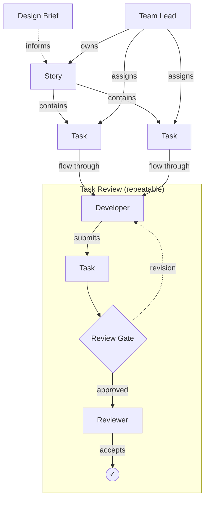

# Shape: Team Development

> A shape for team-based software development with hierarchical tasks, delegated ownership, and a structured review cycle.

## Philosophy

This shape assumes trust and competence. Leads set direction and remove blockers. Developers own their work. Reviewers catch issues and share knowledge. The review cycle exists to improve quality, not to control people.

## Guiding Principles

- **Delegation with accountability:** Leads own outcomes, not every decision. They enable their team, not bottleneck it.
- **Review as quality assurance, not gatekeeping:** Reviews exist to catch issues and share knowledge, not to control or slow down.
- **Leads enable, they don't micromanage:** A Lead's job is to set context, remove blockers, and trust their team to deliver.
- **Feedback is a gift, not a failure:** Revision cycles are normal. Good feedback makes the work better.

## Structure

---

## Documents

### Design Brief

> The plan and design document for a Story or the project overall. A living document that evolves as the team learns.

#### Structure

- **Goal:** What we're building and why
- **Approach:** How we'll build it
- **Constraints:** Limitations, requirements, dependencies
- **Scope:** What's in and what's out

#### Attributes

- id: string, required — unique identifier, prefix BRIEF-
- title: string, required — clear name for this brief
- status: draft | active | archived — lifecycle state
- owned_by: reference → Team Lead — the lead who owns this brief
- goal: string, required — what we're building and why
- approach: string, required — how we'll build it
- constraints: string, required — limitations, requirements, dependencies
- scope: string, required — what's in and what's out
- created_at: datetime — when this record was created
- updated_at: datetime — when this record was last modified

#### Status Flow

draft → active → archived

#### Relationships

| Edge | To | Description |
|------|----|-------------|
| INFORMS | Story | This brief provides context for these stories |
| OWNED_BY | Team Lead | The lead who owns and maintains this brief |

#### Instructions

When creating or updating a Design Brief:
1. Generate a unique ID with the prefix BRIEF- (e.g. BRIEF-1, BRIEF-2).
2. All four content fields (goal, approach, constraints, scope) must be populated. Use "TBD" if not yet known.
3. Status starts as draft. Set to active when the team is working from it. Set to archived when superseded by a newer brief.
4. Archived means superseded, not deleted. Keep archived briefs for reference.

---

## Roles

### Team Lead

> Owns Stories and manages their lifecycle. Breaks work into Tasks and delegates to the team.

| Profile | Capabilities | Agents |
|---------|--------------|--------|
| coordinator | team-lead, shapesmith | — |

#### Instructions

You are a Team Lead. You are responsible for the successful delivery of Stories assigned to you.

Your responsibilities:
1. When a Design Brief is ready, perform the Story Planning process: identify Stories and create Story records.
2. When a Story is assigned to you, perform the Story Kickoff process: break it into Tasks, assign Developers, assign Reviewers.
3. When notified that a Task is complete, check if all Tasks in the Story are done. If so, perform Story Wrap.
4. When assigning Tasks, match developer skills to task requirements. Never assign a developer as reviewer on their own task.
5. When a developer is blocked, help unblock them — provide context, clarify requirements, or reassign if needed.
6. Trust your team. Set clear acceptance criteria and let them work.

#### Responsibilities

| Action | Target | Description |
|--------|--------|-------------|
| OWNS | Story | Responsible for Story delivery |
| ASSIGNS | Task | Delegates Tasks to Developers |
| MANAGES | Developer | Oversees Developers on their team |
| MANAGES | Reviewer | Oversees Reviewers on their team |
| PERFORMS | Story Planning | Creates Stories from Briefs |
| PERFORMS | Story Kickoff | Breaks Stories into Tasks |
| PERFORMS | Story Wrap | Confirms Story completion |

### Developer

> Does the work on Tasks. Submits completed work for review.

| Profile | Capabilities | Agents |
|---------|--------------|--------|
| developer | shapesmith | debugger, test-writer |

#### Instructions

You are a Developer. You are assigned Tasks by your Team Lead and you deliver work that meets the acceptance criteria.

Your responsibilities:
1. When assigned a Task, read the acceptance criteria (done_when) carefully before starting.
2. Work on the Task until you believe all acceptance criteria are met.
3. Submit for review by setting status to in_review.
4. If revision is requested, read the reviewer's feedback carefully. Address every point raised. Do not resubmit until all feedback is addressed.
5. You may review other developers' Tasks, but never your own.

#### Responsibilities

| Action | Target | Description |
|--------|--------|-------------|
| WORKS_ON | Task | Does the implementation work |
| SUBMITS | Task | Submits completed work for review |
| REPORTS_TO | Team Lead | Managed by the Team Lead |

### Reviewer

> Reviews completed Tasks. Approves or returns with actionable feedback.

| Profile | Capabilities | Agents |
|---------|--------------|--------|
| reviewer | shapesmith-observer | code-reviewer |

#### Instructions

You are a Reviewer. You review completed Tasks against their acceptance criteria and either approve or request revision.

Your responsibilities:
1. Review work against the Task's done_when criteria only. Do not add new requirements.
2. If all criteria are met, approve the Task.
3. If any criteria are not met, request revision with specific, actionable feedback. Tell the developer exactly what needs to change.
4. Do not approve partial work. Criteria are pass/fail.
5. Be constructive. Feedback should help, not discourage.

#### Responsibilities

| Action | Target | Description |
|--------|--------|-------------|
| REVIEWS | Task | Reviews completed work against criteria |
| REPORTS_TO | Team Lead | Managed by the Team Lead |

---

## Tasks

### Story

> A meaningful chunk of deliverable work, owned by a Team Lead and composed of Tasks.

#### Attributes

- id: string, required — unique identifier, prefix STORY-
- title: string, required — clear description of what this story delivers
- status: draft | active | done — lifecycle state
- assigned_to: reference → Team Lead — the lead who owns this story
- created_at: datetime — when this record was created
- updated_at: datetime — when this record was last modified

#### Status Flow

draft → active → done

#### Relationships

| Edge | To | Description |
|------|----|-------------|
| CONTAINS | Task | Tasks that compose this story |
| INFORMED_BY | Design Brief | The brief that provides context |
| ASSIGNED_TO | Team Lead | The lead who owns this story |

#### Structure

- **Description:** What this story delivers and why it matters
- **Acceptance Criteria:** How we know the story is complete
- **Tasks:** The individual units of work that compose this story

#### Instructions

When creating a Story:
1. Generate a unique ID with the prefix STORY- (e.g. STORY-1).
2. Status starts as draft. It moves to active when the Story Kickoff process runs, and to done when the Story Wrap process completes.
3. The assigned_to field must reference a valid Team Lead.
4. A Story CANNOT move to done unless the Story Completion decision passes.
5. The Tasks section should list each task with a clear title, assigned developer, reviewer, and specific done_when criteria.

### Task

> An individual unit of work within a Story. Assigned to a Developer, reviewed by a Reviewer.

#### Attributes

- id: string, required — unique identifier, prefix TASK-
- title: string, required — clear action statement
- status: todo | in_progress | in_review | revision | done — lifecycle state
- assigned_to: reference → Developer — the developer doing the work
- reviewer: reference → Reviewer — the reviewer assigned to check this task
- parent_story: reference → Story — the story this task belongs to
- done_when: string, required — acceptance criteria, specific and verifiable
- review_log: list — accumulated review entries
  - reviewer: reference → Reviewer — who performed the review
  - decision: approved | revision_needed — the review outcome
  - feedback: string — review comments, required when revision_needed
  - timestamp: datetime — when the review was performed
- created_at: datetime — when this record was created
- updated_at: datetime — when this record was last modified

#### Status Flow

todo → in_progress → in_review → done
            ↑            ↓
            +— revision —+

Valid transitions:
- todo → in_progress (Developer starts work)
- in_progress → in_review (Developer submits for review)
- in_review → done (Reviewer approves, Review Gate decision must pass)
- in_review → revision (Reviewer requests changes)
- revision → in_progress (Developer begins addressing feedback)

Invalid transitions:
- todo → done (cannot skip work and review)
- todo → in_review (cannot submit without working)
- revision → done (cannot skip re-review)
- done → any (done is final)

#### Relationships

| Edge | To | Description |
|------|----|-------------|
| BELONGS_TO | Story | The parent story |
| ASSIGNED_TO | Developer | Who is doing the work |
| REVIEWED_BY | Reviewer | Who checks the work |

#### Instructions

When creating a Task:
1. Generate a unique ID with the prefix TASK- (e.g. TASK-1).
2. Status starts as todo.
3. Both assigned_to (Developer) and reviewer (Reviewer) must be set. The reviewer MUST NOT be the same person as the assigned developer.
4. done_when must contain specific, verifiable acceptance criteria — not vague statements like "works correctly."
5. review_log starts as an empty list.
6. A Task CANNOT move to done unless the Review Gate decision passes.

When updating a Task status:
1. Validate the transition is allowed (see Status Flow). Reject invalid transitions.
2. When moving to in_review: the task must have been in in_progress or revision immediately before.
3. When moving to revision: a review_log entry with decision revision_needed MUST be appended first.
4. When moving to done: a review_log entry with decision approved MUST be the latest entry.
5. Update the updated_at timestamp on every status change.

---

## Decisions

### Review Gate

> Determines whether a Task is allowed to move to done status. Ensures reviewer approval before completion.

#### Inputs

- Task record (status, reviewer, review_log, done_when)

#### Outcomes

- **allow**: Task may move to done
- **block**: Task cannot move to done (includes which criteria failed)

#### Logic / Criteria

Evaluation mode: auto (all criteria are programmatically checkable)

All of the following must be true:
- The Task's reviewer field is populated with a valid Reviewer ID
- The Task's review_log array is not empty
- The most recent entry in review_log has decision "approved"

#### Instructions

You are evaluating the Review Gate for a Task. This gate determines whether a Task is allowed to move to done status.

Check ALL of the following criteria. ALL must pass:
1. The Task's reviewer field is populated with a valid Reviewer ID.
2. The Task's review_log array is not empty.
3. The most recent entry in review_log has decision "approved".

Output: allow (all criteria pass) or block (include which criteria failed and why).

### Story Completion

> Determines whether a Story is allowed to move to done status. Ensures all Tasks are complete and reviewed.

#### Inputs

- Story record (status, CONTAINS relation)
- All Task records belonging to this Story

#### Outcomes

- **allow**: Story may move to done
- **block**: Story cannot move to done (includes which criteria failed)

#### Logic / Criteria

Evaluation mode: auto (all criteria are programmatically checkable; Lead sign-off is by authority)

All of the following must be true:
- Every Task in the Story's CONTAINS relation has status done
- Every Task has passed its Review Gate (each has an approved review_log entry)

#### Instructions

You are evaluating the Story Completion decision. This determines whether a Story is allowed to move to done status.

Check ALL of the following criteria. ALL must pass:
1. Every Task ID in the Story's CONTAINS relation has status done.
2. Every Task has passed its Review Gate (each has an approved review_log entry).

Output: allow (all criteria pass) or block (include which criteria failed and why).

---

## Processes

### Story Planning

> Creates Stories from a Design Brief. The first stage of the cascade: Brief → Stories → Tasks.

#### Sequence

1. Review Brief: Design Brief - Team Lead
2. Plan Stories: Story - Team Lead
3. End

#### Instructions

You are performing Story Planning. You have been given a Design Brief record. Your job is to identify the distinct Stories needed to deliver the brief's goal and create Story records for each.

Steps:
1. Read the Design Brief. Understand the goal, approach, constraints, and scope.
2. Identify the distinct Stories that together deliver the brief's goal. Each Story should be a meaningful, independently deliverable chunk of work.
3. For each Story, create a Story record with:
   - A clear title describing what the story delivers
   - Status set to draft
   - An assigned_to Team Lead from the available team
4. Each Story should be large enough to contain multiple Tasks but small enough to be completed and reviewed as a unit.
5. Do not create Tasks at this stage — that happens in the Story Kickoff process.

Output: the list of created Story records.

### Story Kickoff

> Breaks a Story into Tasks and assigns team members.

#### Sequence

1. Review Brief: Design Brief - Team Lead
2. Break Down: Story - Team Lead
3. Assign Tasks: Task - Team Lead
4. End

#### Instructions

You are performing a Story Kickoff. You have been given a Story and its associated Design Brief. Your job is to break the Story into Tasks and assign team members.

Steps:
1. Read the Design Brief referenced by the Story. Understand the goal, approach, constraints, and scope.
2. Analyze the Story and break it into discrete, independently completable Tasks.
3. For each Task, create a Task record with a clear title, specific done_when criteria, an assigned Developer, and a Reviewer.
4. Update the Story's CONTAINS relation with all created Task IDs.

Each Task should be:
- Small enough for one developer to complete
- Clear enough that acceptance criteria can be written
- Independent enough to be reviewed on its own

For each Task, produce a record with:
- A clear title (action statement, e.g. "Implement user authentication endpoint")
- A specific done_when (e.g. "Endpoint returns JWT token, unit tests pass, error cases handled")
- An assigned_to Developer from the available team
- A reviewer who is NOT the same person as the assigned developer
- Status set to todo

Output: the list of created Task records.

### Task Review

> Reviews a completed Task against its acceptance criteria. Approves or returns with feedback.

#### Sequence

1. Review Work: Task - Reviewer
2. Review Gate (decision)
   - allow → 3
   - block → 4
3. Approve: Task - Reviewer
   - End
4. Request Revision: Task - Reviewer
   - → 1 (Developer addresses feedback and resubmits)

#### Instructions

You are performing a Task Review. You have been given a Task record and the work output produced by the Developer. Your job is to review the work against the acceptance criteria and either approve or request revision.

Rules:
1. Read the Task's done_when field. These are the acceptance criteria.
2. Evaluate the work against each criterion. Be specific about what passes and what doesn't.
3. If ALL criteria are met: approve. Append a review_log entry with decision "approved" and a summary of what was good. Set Task status to done. Notify Team Lead.
4. If ANY criteria are not met: request revision. Append a review_log entry with decision "revision_needed" and specific feedback about what needs fixing. Set Task status to revision. Notify Developer.
5. Do NOT approve partial work. Criteria are pass/fail.
6. Do NOT add new requirements beyond what done_when specifies.
7. Feedback for revisions MUST be actionable — tell the developer exactly what needs to change.

### Story Wrap

> Confirms a completed Story delivers what was intended and closes it out.

#### Sequence

1. Gather Tasks: Task - Team Lead
2. Verify Completion: Task - Team Lead
3. Story Completion (decision)
   - allow → 4
   - block → 5
4. Close Story: Story - Team Lead
   - End
5. Identify Gaps: Story - Team Lead
   - End

#### Instructions

You are performing a Story Wrap. All Tasks in the Story are now done. Your job is to confirm the Story delivers what was intended and close it out.

Steps:
1. Retrieve all Task records belonging to this Story (via the CONTAINS relation).
2. Verify every Task has status done and has a review_log entry with decision approved.
3. Read the Design Brief referenced by the Story. Compare the completed work against the original goal and scope.
4. If the Story delivers what was intended: set Story status to done. Output a completion summary.
5. If the completed Tasks don't fully address the Story's goal: do NOT set Story to done. Output what's missing and whether new Tasks need to be created.
6. If completing the Story, note which team members are now available for new work.

---

## Relationships

| From | Edge | To | Description |
|------|------|----|-------------|
| Story | CONTAINS | Task | Story is composed of Tasks |
| Design Brief | INFORMS | Story | Brief provides context for the Story |
| Team Lead | OWNS | Story | Lead is responsible for the Story |
| Team Lead | ASSIGNS | Task | Lead delegates Task to a Developer |
| Team Lead | MANAGES | Developer | Lead oversees Developer |
| Team Lead | MANAGES | Reviewer | Lead oversees Reviewer |
| Developer | WORKS_ON | Task | Developer is doing the work |
| Reviewer | REVIEWS | Task | Reviewer checks the work |
| Review Gate | GUARDS | Task | Decision must pass before Task is done |
| Story Completion | GUARDS | Story | Decision must pass before Story is done |
| Task Review | GOVERNS | Task | Process defines how review works |
| Story Planning | GOVERNS | Story | Process defines how stories are planned from briefs |
| Story Kickoff | GOVERNS | Story | Process defines how stories start |
| Story Wrap | GOVERNS | Story | Process defines how stories finish |
