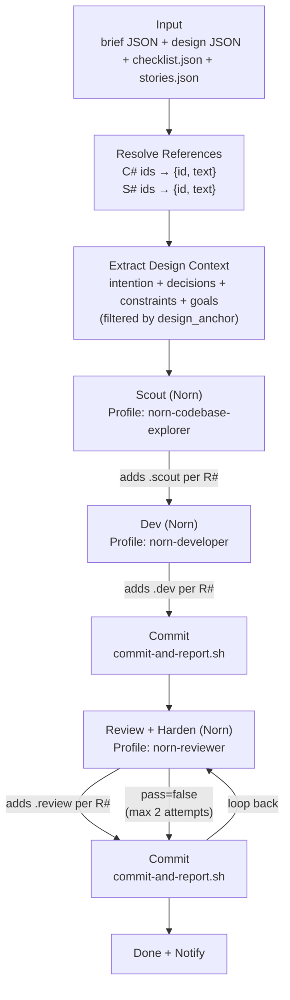
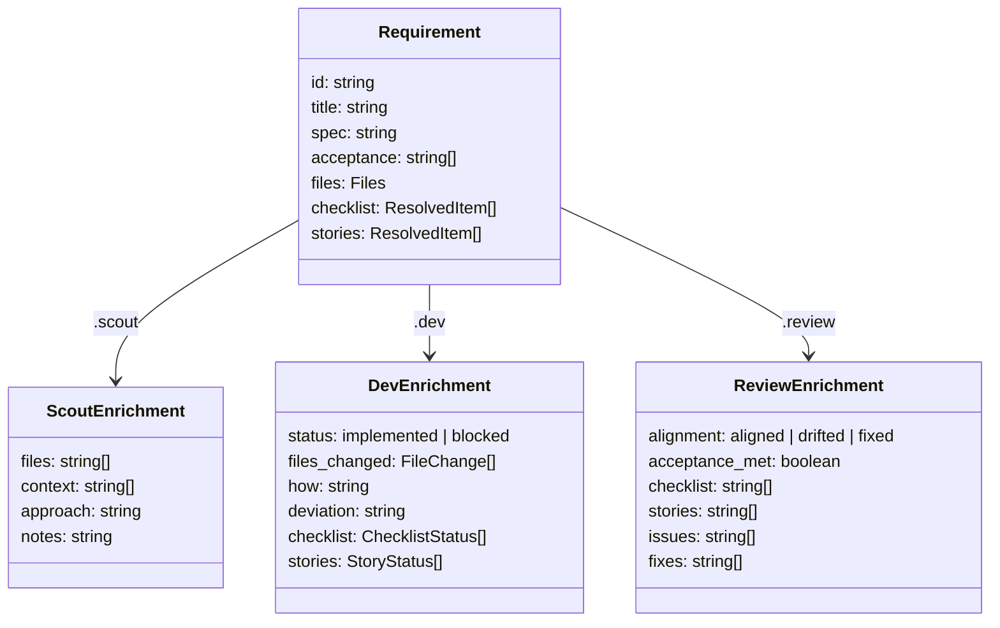

# onatopp-dev-norn — Data Flow

## Pipeline



## Enrichment Shape Per R#

Each requirement starts from the brief and accumulates one sub-object at each stage.



## What Each Step Receives

### Scout

| Component | Source | Size |
|-----------|--------|------|
| Instructions | Static | ~500 chars |
| Design context | design.json (filtered: intention, constraints, goals, relevant decisions) | ~800 chars |
| Requirements | Brief JSON (with resolved C#/S# text) | ~3K chars |
| Boundaries | Brief JSON | ~300 chars |
| Design file reference | Path on disk | ~80 chars |
| **Total** | | **~5K chars** |

The scout has file read tools and can access the full design doc, checklist, stories, and codebase on disk.

### Dev

| Component | Source | Size |
|-----------|--------|------|
| Instructions | Static | ~500 chars |
| Design context | Same filtered set as scout | ~800 chars |
| Brief task description | Brief JSON | ~300 chars |
| Requirements + scout context | Brief requirements with .scout enrichment rendered inline | ~5K chars |
| Boundaries | Brief JSON | ~300 chars |
| Verification items | Scout output | ~200 chars |
| Design file reference | Path on disk | ~80 chars |
| **Total** | | **~7K chars** |

Previously ~48K (exchange-workspaces) to ~70K+ (messaging).

### Review

| Component | Source | Size |
|-----------|--------|------|
| Instructions | Static | ~500 chars |
| Design context | Same filtered set | ~800 chars |
| Requirements + scout + dev context | Full enrichment chain rendered inline | ~7K chars |
| Boundaries | Brief JSON | ~300 chars |
| Verification criteria | Brief + scout | ~500 chars |
| Dev attestation | Dev output | ~100 chars |
| Design file reference | Path on disk | ~80 chars |
| **Total** | | **~9K chars** |

## What Was Removed

| Component | Was | Now |
|-----------|-----|-----|
| Create Tasks step | Wrote to ~/.claude/tasks/ (Norn can't use it) | Removed entirely |
| Run Checks step | Ran full check suite + retry loop | Removed (dev runs checks itself per profile) |
| File scope enforcement | Reverted out-of-scope files | Removed |
| Cargo fmt check | Separate format verification | Removed |
| Full DESIGN.md inline | ~23K chars per step, 3 steps = ~69K | ~800 chars filtered + file reference |
| Full checklist.json | ~9K chars (86 items when brief needs 6) | Resolved inline in requirements (~700 chars) |
| Full stories.json | ~4K chars (21 items when brief needs 1) | Resolved inline in requirements (~300 chars) |
| TaskList/TaskUpdate instructions | Referenced Claude Code tasks Norn can't access | Removed |
| Scout tasks array | Task decomposition Norn doesn't use | Removed from schema |
| Brief doc duplication | Rendered as full separate document | Requirements array IS the brief |

## Final Composite Output

After all three steps, the requirements array for the execution record:

```json
{
  "id": "R1",
  "title": "Move StorageError to libmessage",
  "spec": "WHEN any libmessage operation...",
  "acceptance": ["StorageError defined in..."],
  "files": {"create": [...], "modify": [...]},
  "checklist": [{"id": "C4", "text": "StorageError defined in..."}],
  "stories": [{"id": "S7", "text": "As a developer..."}],
  "scout": {
    "files": ["crates/meridian-storage-redis/src/error.rs:1-40"],
    "context": ["Uses thiserror, 7 variants"],
    "approach": "Follow redis error.rs pattern",
    "notes": "3 callers need updating"
  },
  "dev": {
    "status": "implemented",
    "files_changed": [{"path": "...", "change": "created", "note": "..."}],
    "how": "Created error.rs, updated callers",
    "deviation": "",
    "checklist": [{"id": "C4", "done": true, "note": "At new path"}],
    "stories": [{"id": "S7", "satisfied": true, "note": "Imports updated"}]
  },
  "review": {
    "alignment": "aligned",
    "acceptance_met": true,
    "checklist": ["C4"],
    "stories": ["S7"],
    "issues": [],
    "fixes": ["Added missing doc comment"]
  }
}
```

## Design Context Extraction

From `design.json` (design.schema.json format), the workflow extracts:

| Field | Included | Filtering |
|-------|----------|-----------|
| intention | Always | Full text (1 paragraph) |
| constraints | Always | All items (typically 5-10) |
| goals | Always | All items (typically 3-7) |
| decisions | Filtered | Only active decisions matching brief.design_anchor IDs |
| problem | Omitted | Not needed for implementation |
| non_goals | Omitted | Scope protection is in brief.boundaries |
| solution | Omitted | Scout extracts relevant context from codebase |
| structure | Omitted | File paths are in brief requirements |
| inventory | Omitted | Scout gathers current state |
| topics | Omitted | Available on disk if needed |
